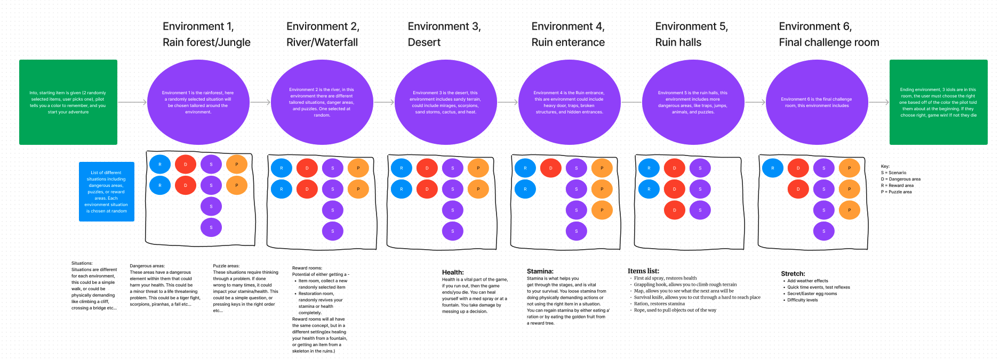
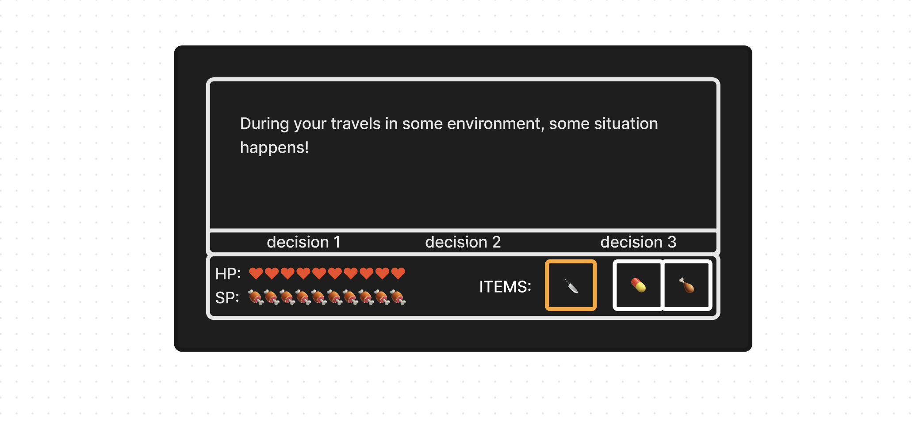

# Text Adventure

Made by: Anthony Lopez, Araceli Garcia, Brenden Moore, Deiosha Sparks

Text Adventure is a Command Line Interface game that changes as you play! 
You are a treasure hunter in search of a mystical idol said to grant youth and luck to anyone that drinks from its cup. You decide to seek out this idol in the ancient ruins of the dangerous Anradesha jungle. You drop out of a helicopter a few miles from the resting place of the idol. You now have a decision to make, what starting piece of equipment will you take? Choose between a grappling hook and first aid med. (Maybe other items) You dont know whats in store for you in this jungle, but thats for you to decide!!

[Team Trello Board](https://trello.com/b/AjdJiG3i/text-adventure)

Domain Model

Wireframe
